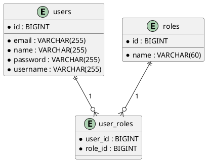

# Todo Management System

## Table of Contents

- [Introduction](#introduction)
- [Features](#features)
- [Requirements](#requirements)
- [Tech Stack](#tech-stack)
- [Installation](#installation)
- [Usage](#usage)
- [Project Structure](#project-structure)
- [Development Phases](#development-phases)
- [Docker Commands](#docker-commands)
- [Contributing](#contributing)
- [License](#license)
- [Contact](#contact)

## Introduction

Welcome to the Todo Management System repository! This project is a comprehensive application designed to manage tasks efficiently. It is built with a modern tech stack and follows best practices for security and user management.

## Features

- User authentication and authorization
- Role-based access control
- Responsive user interface
- CRUD operations for tasks
- Secure REST APIs
- Registration and login modules


## Requirements 

## Requirement 1 - Build REST APIs
### Build Below REST APIs for Todo Management Module:
- Add Todo
- Get Todo
- Get All Todos
- Update Todo
- Delete Todo
- Complete Todo
- In-complete Todo


## Requirement 2 - Build Frontend React App
### Build Frontend React App (Consume REST APIs) for Todo Management Module

User should be able to perform the following operations:
- Add new todo
- List all todos in a table
- Update particular todo
- Delete particular todo
- Mark todo as complete
- Mark todo as incomplete

## Requirement 3 - Secure REST APIs
### Secure all the Todo REST API using Spring Security and implement Role-Based Authorization

### API Endpoints and Roles
- **Add Todo**  
  `ADMIN`
- **Get Todo**  
  `ADMIN, USER`
- **Get All Todos**  
  `ADMIN, USER`
- **Update Todo**  
  `ADMIN`
- **Delete Todo**  
  `ADMIN`
- **Complete Todo**  
  `ADMIN, USER`
- **Incomplete Todo**  
  `ADMIN, USER`


# User and Role JPA Entities


  


## Tech Stack

### Frontend
- **Framework**: React
- **Styling**: Tailwind CSS
- **State Management**: Redux
- **Routing**: React Router

### Backend
- **Framework**: Spring Boot
- **Database**: MySQL
- **Authentication**: JWT (JSON Web Tokens)
- **API Documentation**: Swagger

### Tools and Libraries
- **Version Control**: Git
- **Containerization**: Docker
- **Testing**: JUnit


### Project Structure
<pre>
<code>
.
├── frontend
│   ├── public
│   │   ├── index.html
│   │   └── ...
│   ├── src
│   │   ├── components
│   │   │   └── ...
│   │   ├── pages
│   │   │   └── ...
│   │   ├── redux
│   │   │   └── ...
│   │   ├── App.js
│   │   └── index.js
│   └── package.json
├── backend
│   ├── src
│   │   ├── main
│   │   │   ├── java
│   │   │   │   └── com
│   │   │   │       └── yourcompany
│   │   │   │           └── yourproject
│   │   │   │               └── ...
│   │   │   ├── resources
│   │   │       └── application.properties
│   ├── Dockerfile
│   └── ...
├── docker-compose.yml
├── .env
├── README.md
└── ...
</code>
</pre>


## Development Phase

1. **Backend API**
   - Develop the RESTful API using Spring Boot.
   - Implement CRUD operations for tasks.

2. **Frontend Interface with API Integration**
   - Create the user interface using React.
   - Integrate the frontend with the backend API.

3. **Secure the REST APIs with Spring Security and JWT**
   - Implement JWT authentication.
   - Secure the endpoints using Spring Security.

4. **Role-based Access**
   - Define user roles and permissions.
   - Implement role-based access control.

5. **Registration and Login Modules - UI**
   - Develop the registration and login pages.
   - Integrate with the backend authentication.


## Docker Commands

You can insert this section into the README.md file under the "Docker Commands" heading. This format uses code blocks for the commands for better readability.

### Bring down the containers
```bash
docker-compose down

Bring down the containers and remove volumes
docker-compose down -v

Bring up the containers
docker-compose up

Bring up the containers in detached mode (without logs)
docker-compose up -d


## Installation

### Prerequisites
- Node.js
- npm
- Docker
- MySQL

### Steps

1. Clone the repository
   ```bash
   git clone https://github.com/yourusername/your-repo-name.git
2. Navigate to the project directory
   ``` bash
    cd your-repo-name
3. Install dependencies for the frontend
    ``` bash
      cd frontend
      npm install
